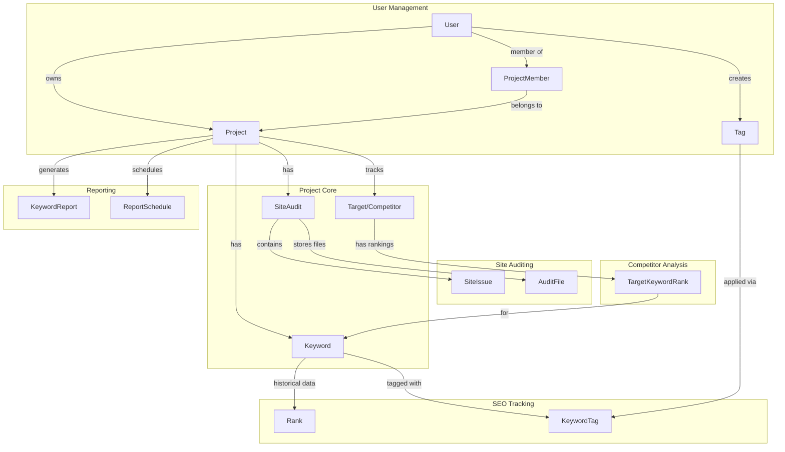
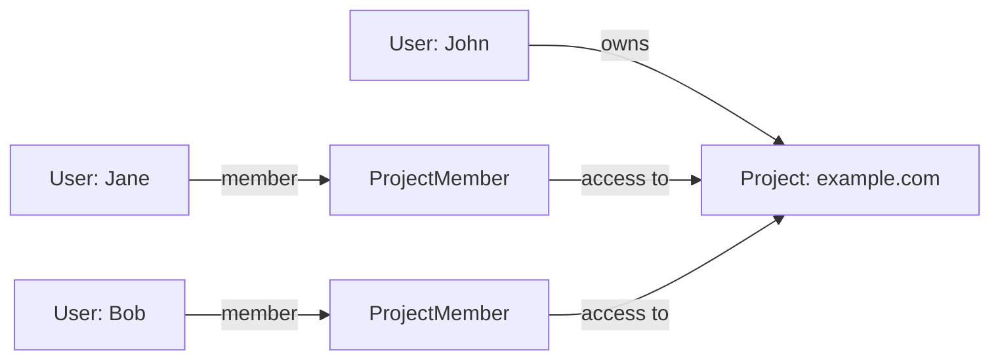
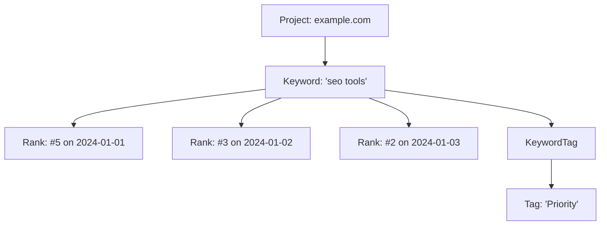
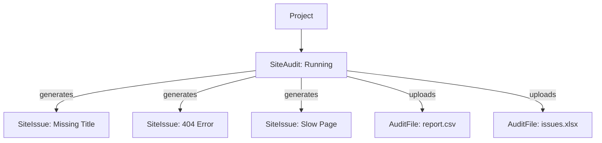
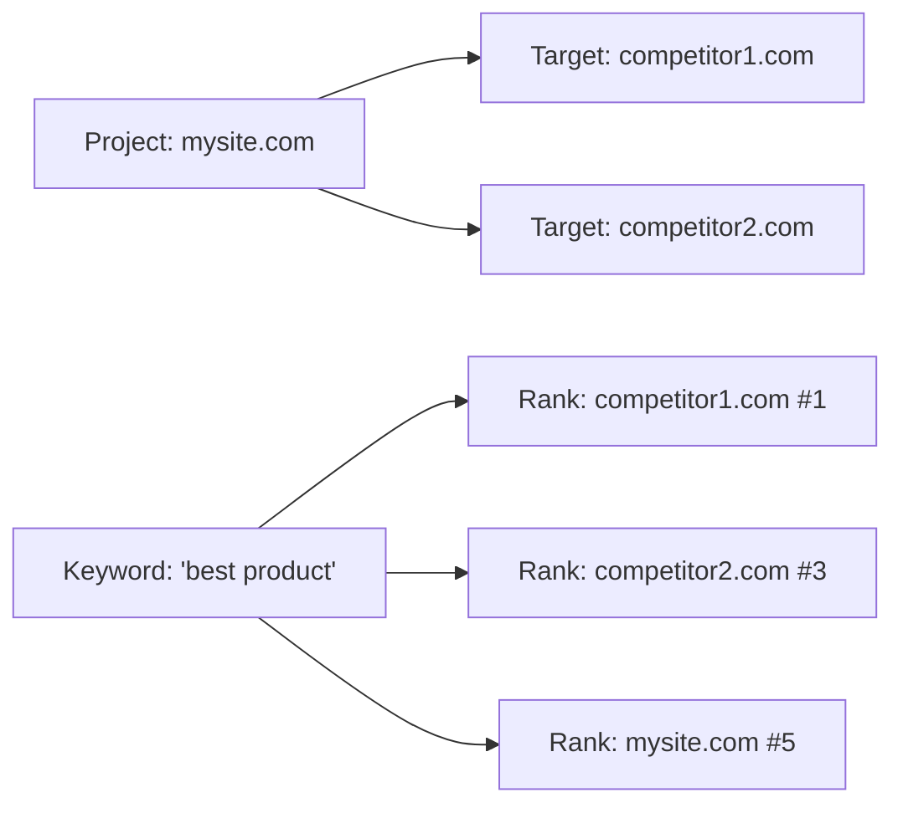

# LimeClicks Entity Relationship Diagram (Visual)

## Complete Database ERD

```mermaid
erDiagram
    User ||--o{ Project : owns
    User ||--o{ ProjectMember : has
    User ||--o{ Tag : creates
    User ||--o{ KeywordReport : generates
    User ||--o{ ReportSchedule : schedules
    User ||--o{ ProjectInvitation : sends
    User ||--o{ ProjectInvitation : accepts
    
    Project ||--o{ ProjectMember : has
    Project ||--o{ ProjectInvitation : has
    Project ||--o{ Keyword : contains
    Project ||--o{ SiteAudit : has
    Project ||--o{ Target : tracks
    Project ||--o{ KeywordReport : generates
    Project ||--o{ ReportSchedule : has
    
    ProjectMember }o--|| User : "member"
    ProjectMember }o--|| Project : "belongs_to"
    
    Keyword ||--o{ Rank : "has_history"
    Keyword ||--o{ KeywordTag : tagged_with
    Keyword ||--o{ TargetKeywordRank : tracked_by
    Keyword }o--|| Project : belongs_to
    
    Tag ||--o{ KeywordTag : applied_to
    Tag }o--|| User : owned_by
    
    KeywordTag }o--|| Keyword : tags
    KeywordTag }o--|| Tag : uses
    
    Rank }o--|| Keyword : "records"
    
    SiteAudit ||--o{ SiteIssue : contains
    SiteAudit ||--o{ AuditFile : stores
    SiteAudit }o--|| Project : audits
    
    SiteIssue }o--|| SiteAudit : found_in
    SiteIssue }o--o| SiteAudit : first_detected
    
    AuditFile }o--|| SiteAudit : belongs_to
    
    Target ||--o{ TargetKeywordRank : has_rankings
    Target }o--|| Project : monitors
    Target }o--o| User : created_by
    
    TargetKeywordRank }o--|| Target : "for_target"
    TargetKeywordRank }o--|| Keyword : "for_keyword"
    
    KeywordReport }o--|| Project : "for_project"
    KeywordReport }o--o| User : created_by
    KeywordReport }o--o{ Keyword : includes
    
    ReportSchedule }o--|| Project : "for_project"
    ReportSchedule }o--o| User : created_by
    ReportSchedule }o--o| KeywordReport : last_report
    ReportSchedule }o--o{ Keyword : includes

    User {
        int id PK
        string username UK
        string email UK
        string password
        boolean email_verified
        uuid verification_token
        uuid password_reset_token
        datetime verification_token_created
        datetime password_reset_token_created
        string first_name
        string last_name
        boolean is_active
        boolean is_staff
        datetime date_joined
    }
    
    Project {
        int id PK
        int user_id FK
        string domain
        string title
        boolean active
        datetime created_at
        datetime updated_at
    }
    
    ProjectMember {
        int id PK
        int project_id FK
        int user_id FK
        string role
        datetime joined_at
    }
    
    ProjectInvitation {
        int id PK
        int project_id FK
        string email
        string role
        uuid token UK
        string status
        int invited_by_id FK
        datetime created_at
        datetime expires_at
        datetime accepted_at
        int accepted_by_id FK
    }
    
    Keyword {
        int id PK
        int project_id FK
        string keyword
        string country_code
        string location
        string uule
        int rank
        string rank_status
        int rank_diff_from_last_time
        string rank_url
        bigint number_of_results
        int initial_rank
        int highest_rank
        datetime scraped_at
        datetime next_crawl_at
        datetime last_force_crawl_at
        string crawl_priority
        int crawl_interval_hours
        int force_crawl_count
        string scrape_do_file_path
        json scrape_do_files
        datetime scrape_do_at
        text error
        string last_error_message
        int success_api_hit_count
        int failed_api_hit_count
        json ranking_pages
        json top_competitors
        string impact
        boolean processing
        boolean archive
        datetime created_at
        datetime updated_at
    }
    
    Rank {
        int id PK
        int keyword_id FK
        int rank
        boolean is_organic
        boolean has_map_result
        boolean has_video_result
        boolean has_image_result
        string search_results_file
        datetime created_at
    }
    
    Tag {
        int id PK
        int user_id FK
        string name
        string slug
        string color
        text description
        boolean is_active
        datetime created_at
        datetime updated_at
    }
    
    KeywordTag {
        int id PK
        int keyword_id FK
        int tag_id FK
        datetime created_at
    }
    
    SiteAudit {
        int id PK
        int project_id FK
        int audit_frequency_days
        int manual_audit_frequency_days
        boolean is_audit_enabled
        int max_pages_to_crawl
        datetime last_automatic_audit
        datetime last_manual_audit
        datetime next_scheduled_audit
        datetime last_audit_date
        json issues_overview
        string status
        string temp_audit_dir
        json crawl_overview
        float average_page_size_kb
        float average_load_time_ms
        int total_pages_crawled
        string pagespeed_mobile_response_r2_path
        string pagespeed_desktop_response_r2_path
        int performance_score_mobile
        int performance_score_desktop
        float overall_site_health_score
        datetime created_at
        datetime updated_at
    }
    
    SiteIssue {
        int id PK
        int site_audit_id FK
        string url
        string issue_type
        string issue_category
        string severity
        json issue_data
        string indexability
        string indexability_status
        int inlinks_count
        string status
        int first_detected_audit_id FK
        datetime resolved_at
        datetime created_at
        datetime updated_at
    }
    
    AuditFile {
        int id PK
        int site_audit_id FK
        string file_type
        string original_filename
        string r2_path
        bigint file_size
        string mime_type
        string checksum
        datetime uploaded_at
    }
    
    Target {
        int id PK
        int project_id FK
        string domain UK
        string name
        boolean is_manual
        datetime created_at
        datetime updated_at
        int created_by_id FK
    }
    
    TargetKeywordRank {
        int id PK
        int target_id FK
        int keyword_id FK
        int rank
        string rank_url
        datetime scraped_at
        datetime created_at
        datetime updated_at
    }
    
    KeywordReport {
        int id PK
        int project_id FK
        string name
        string report_type
        date start_date
        date end_date
        string report_format
        json include_tags
        json exclude_tags
        boolean fill_missing_ranks
        boolean include_competitors
        boolean include_graphs
        string status
        text error_message
        string csv_file_path
        string pdf_file_path
        bigint csv_file_size
        bigint pdf_file_size
        datetime processing_started_at
        datetime processing_completed_at
        int processing_duration_seconds
        int created_by_id FK
        boolean send_email_notification
        boolean email_sent
        datetime email_sent_at
        int download_count
        datetime last_downloaded_at
        datetime created_at
        datetime updated_at
    }
    
    ReportSchedule {
        int id PK
        int project_id FK
        string name
        string frequency
        int day_of_week
        int day_of_month
        time time_of_day
        int report_period_days
        string report_format
        json include_tags
        json exclude_tags
        boolean fill_missing_ranks
        boolean include_competitors
        boolean include_graphs
        json email_recipients
        boolean is_active
        datetime last_run_at
        int last_report_id FK
        datetime next_run_at
        int created_by_id FK
        datetime created_at
        datetime updated_at
    }
```



## Simplified Core Relationships View



## Key Relationship Patterns

### 1. User-Project Relationship


### 2. Keyword Tracking Flow


### 3. Site Audit Process


### 4. Competitor Tracking


## Database Constraints & Rules

### Unique Constraints
- `User`: (username), (email)
- `Project + Keyword`: (project_id, keyword, country)
- `Project + Target`: (project_id, domain)
- `User + Tag`: (user_id, name)
- `Project + User`: (project_id, user_id) in ProjectMember
- `Keyword + Tag`: (keyword_id, tag_id) in KeywordTag
- `Target + Keyword`: (target_id, keyword_id) in TargetKeywordRank

### Business Rules
1. **Max 3 manual targets** per project
2. **Force crawl limit**: Once per hour per keyword
3. **Manual audit limit**: Minimum 1 day between runs
4. **Report period**: Maximum 60 days
5. **Invitation expiry**: 14 days
6. **Verification token expiry**: 24 hours
7. **Password reset token expiry**: 1 hour

### Cascade Rules
- Delete User → Delete owned Projects
- Delete Project → Delete all Keywords, SiteAudits, Targets
- Delete Keyword → Delete all Ranks, KeywordTags
- Delete SiteAudit → Delete all SiteIssues, AuditFiles
- Delete Target → Delete all TargetKeywordRanks

## Data Flow Examples

### 1. New Keyword Addition
```
User → Add Keyword → Project
         ↓
    Create Keyword Record
         ↓
    Schedule First Crawl (high priority)
         ↓
    Celery Task → ScrapeD.o API
         ↓
    Parse Results → Create Rank Record
         ↓
    Update Keyword Stats
```

### 2. Site Audit Execution
```
User → Trigger Audit → Project
         ↓
    Create SiteAudit (status: pending)
         ↓
    Celery Task → Screaming Frog
         ↓
    Parse CSV Files → Create SiteIssues
         ↓
    Upload Files to R2 → Create AuditFiles
         ↓
    Calculate Health Score
         ↓
    Update SiteAudit (status: completed)
```

### 3. Report Generation
```
Schedule/Manual Trigger → KeywordReport
         ↓
    Gather Keywords (filters/tags)
         ↓
    Fetch Historical Ranks
         ↓
    Generate CSV/PDF
         ↓
    Upload to R2 Storage
         ↓
    Send Email Notification
```

## Performance Indexes

### Primary Indexes
- All Primary Keys (id)
- All Foreign Keys (*_id)

### Custom Indexes
```sql
-- Keywords
CREATE INDEX idx_keyword_project_keyword ON keywords_keyword(project_id, keyword);
CREATE INDEX idx_keyword_project_rank ON keywords_keyword(project_id, rank);
CREATE INDEX idx_keyword_processing ON keywords_keyword(processing, archive);
CREATE INDEX idx_keyword_crawl ON keywords_keyword(next_crawl_at, processing);

-- Ranks
CREATE INDEX idx_rank_keyword_created ON keywords_rank(keyword_id, created_at DESC);

-- Site Issues
CREATE INDEX idx_issue_audit_severity ON site_audit_siteissue(site_audit_id, severity);

-- Reports
CREATE INDEX idx_report_project_created ON keyword_reports(project_id, created_at DESC);
```

This visual ERD provides a complete overview of the database structure, relationships, and data flow patterns in the LimeClicks application.