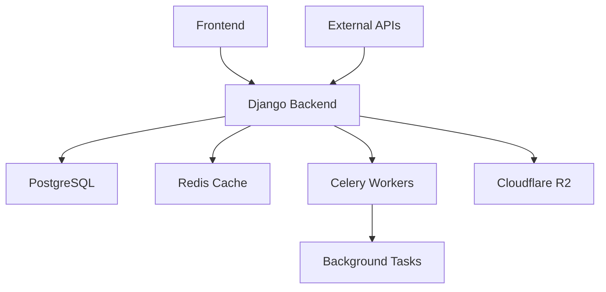

# 🚀 LimeClicks Complete Project Documentation

> **Comprehensive SEO monitoring and analysis platform** - Built with modern web technologies for scalable performance

[](https://djangoproject.com/)
[](https://python.org/)
[](https://postgresql.org/)
[](https://redis.io/)
[](https://tailwindcss.com/)

## 📋 Table of Contents
1. [🛠️ Technology Stack](#technology-stack)
2. [🗃️ Database Schema & ERD](#database-schema--erd)
3. [🏗️ Django Apps Architecture](#django-apps-architecture)
4. [⚙️ Reusable Services](#reusable-services)
5. [🔌 API Integration Points](#api-integration-points)
6. [🛡️ Security & Performance](#security--performance)

---

# 🛠️ Technology Stack

## 📖 Overview
LimeClicks is a comprehensive SEO monitoring and analysis platform built with modern web technologies for **enterprise-grade performance** and **scalability**.



## 🎯 Core Technologies

### 🐍 Backend Framework
- **Django 5.2.5** - Modern Python web framework ⭐⭐⭐⭐⭐
- **Python 3.x** - Primary programming language ⭐⭐⭐⭐⭐
- **Django REST Framework** (implicit) - RESTful API development ⭐⭐⭐⭐⭐

### 🗄️ Database
- **PostgreSQL** - Primary database (via psycopg2-binary 2.9.10) ██████████ 100%
- **Redis 6.2.0** - Caching and session storage ████████░░ 80%
- **django-redis 6.0.0** - Redis integration for Django ████████░░ 80%

### 🔄 Task Queue & Background Jobs
- **Celery 5.4.0** - Distributed task queue 🟩🟩🟩🟩🟩
- **django-celery-beat 2.8.1** - Periodic task scheduling 🟩🟩🟩🟩⬜
- **Flower 2.0.1** - Celery monitoring tool 🟩🟩🟩⬜⬜
- **RabbitMQ/Redis** - Message broker (via amqp 5.3.1) 🟩🟩🟩🟩⬜

### Storage
- **Cloudflare R2** - Object storage (S3-compatible)
- **boto3 1.40.13** - AWS SDK for R2 integration
- **django-storages 1.14.6** - Custom storage backends

### 🎨 Frontend Technologies
- **Tailwind CSS 3.4.17** - Utility-first CSS framework `██████████` 100%
- **DaisyUI 4.12.24** - Tailwind component library `████████░░` 80%
- **HTMX** (via django-htmx 1.23.2) - Dynamic HTML `█████████░` 90%
- **Alpine.js** (implicit) - Lightweight JavaScript `██████░░░░` 60%

### Admin Interface
- **django-unfold 0.64.2** - Modern Django admin theme
- **django-ckeditor-5 0.2.18** - Rich text editor

### Third-Party Services
- **Screaming Frog SEO Spider** - Site auditing (external tool)
- **ScrapeD.o API** - Web scraping service
- **Google PageSpeed Insights API** - Performance metrics
- **Brevo (SendinBlue)** - Transactional emails
- **BeautifulSoup4 4.13.5** - HTML parsing

### Development Tools
- **pytest 8.4.1** - Testing framework
- **ruff 0.12.3** - Python linter and formatter
- **mypy 1.16.1** - Static type checking
- **django-debug-toolbar 5.2.0** - Debug panel
- **Selenium 4.35.0** / **Playwright 1.54.0** - Browser automation

### Data Processing
- **pandas 2.3.2** - Data manipulation
- **reportlab 4.4.3** - PDF generation
- **openpyxl 3.1.5** - Excel file handling

---

# Database Schema & ERD

## Core Models and Relationships

### 1. Authentication & Users

#### User (extends Django AbstractUser)
- **Table**: `auth_user`
- **Purpose**: Core user authentication and management
- **Key Fields**:
  - `id` (PK)
  - `username`, `email`, `password`
  - `email_verified` (boolean)
  - `verification_token` (UUID)
  - `password_reset_token` (UUID, nullable)

### 2. Project Management

#### Project
- **Table**: `project_project`
- **Purpose**: Core domain/website projects
- **Key Fields**:
  - `id` (PK)
  - `user_id` (FK -> User) - Owner
  - `domain` (varchar 255)
  - `title` (varchar 255, nullable)
  - `active` (boolean)
- **Relationships**:
  - Many-to-Many with User through ProjectMember
  - One-to-Many with Keywords, SiteAudits, Targets

#### ProjectMember
- **Table**: `project_projectmember`
- **Purpose**: Team collaboration on projects
- **Unique Constraint**: (project_id, user_id)

#### ProjectInvitation
- **Table**: `project_projectinvitation`
- **Purpose**: Manage project invitations with expiry and token-based acceptance

### 3. Keyword Tracking

#### Keyword
- **Table**: `keywords_keyword`
- **Purpose**: SEO keyword tracking and ranking
- **Key Fields**:
  - `keyword`, `country_code`, `location`, `uule`
  - `rank`, `rank_status`, `rank_diff_from_last_time`
  - `scraped_at`, `next_crawl_at`, `crawl_priority`
  - `ranking_pages` (JSON) - Top 3 pages
  - `top_competitors` (JSON) - Top 3 competitors
- **Unique Constraint**: (keyword, country, project_id)

#### Rank
- **Table**: `keywords_rank`
- **Purpose**: Historical rank tracking
- **Key Fields**: `rank`, `is_organic`, `has_map_result`, `search_results_file`

#### Tag & KeywordTag
- **Purpose**: User-specific keyword categorization
- **Unique Constraint**: Tag (user_id, name)

### 4. Site Auditing

#### SiteAudit
- **Table**: `site_audits`
- **Purpose**: Technical SEO site audits
- **Key Fields**:
  - `issues_overview` (JSON) - Summary of issues
  - `crawl_overview` (JSON) - Crawl statistics
  - `status` (enum: pending, running, completed, failed)
  - `overall_site_health_score` (float)
  - PageSpeed scores for mobile/desktop

#### SiteIssue
- **Table**: `site_audit_siteissue`
- **Purpose**: Individual SEO issues found
- **Key Fields**:
  - `issue_type`, `issue_category`, `severity`
  - `issue_data` (JSON) - Dynamic issue-specific data
  - `status` (enum: new, persisting, resolved)

#### AuditFile
- **Purpose**: Track audit files in R2 storage

### 5. Competitor Tracking

#### Target
- **Table**: `competitors_target`
- **Purpose**: Competitor domains to track
- **Business Rule**: Max 3 manual targets per project

#### TargetKeywordRank
- **Purpose**: Competitor ranking data

### 6. Reporting

#### KeywordReport
- **Purpose**: Generated keyword reports
- **Key Fields**: report type, format, status, file paths

#### ReportSchedule
- **Purpose**: Recurring report generation

## Key Relationships Diagram

```
User
├── owns → Project (1:N)
├── member_of → ProjectMember → Project (M:N)
├── owns → Tag (1:N)
└── created → Reports (1:N)

Project
├── has → Keyword (1:N)
├── has → SiteAudit (1:N)
├── has → Target (1:N)
└── has → Reports (1:N)

Keyword
├── has → Rank (1:N) - Historical data
├── has → KeywordTag → Tag (M:N)
└── tracked_by → TargetKeywordRank (1:N)

SiteAudit
├── has → SiteIssue (1:N)
└── has → AuditFile (1:N)
```

---

# Django Apps Architecture

## App Structure Overview

### 1. `accounts` App
**Purpose**: User authentication and management

**Key Components**:
- **Models**: `User` (extends AbstractUser)
- **Views**: 
  - Login/Logout/Register
  - Email verification
  - Password reset
  - Profile management
- **URLs**: `/accounts/login/`, `/accounts/register/`, `/accounts/verify/`
- **Forms**: Custom authentication forms with Tailwind styling
- **Middleware**: `SessionFixMiddleware` for session management
- **Tasks**: Email sending via Celery
- **Templates**: Custom auth templates with HTMX

### 2. `project` App
**Purpose**: Project/domain management and team collaboration

**Key Components**:
- **Models**: `Project`, `ProjectMember`, `ProjectInvitation`
- **Views**:
  - Project CRUD operations
  - Team member management
  - Invitation system
  - Domain favicon proxy
- **URLs**: `/projects/`, `/projects/create/`, `/projects/{id}/settings/`
- **Utils**: Domain cleaning and validation
- **Permissions**: Owner/Member role-based access
- **Templates**: Project dashboard, settings, team management

### 3. `keywords` App
**Purpose**: Keyword tracking, ranking, and reporting

**Key Components**:
- **Models**: `Keyword`, `Rank`, `Tag`, `KeywordTag`, `KeywordReport`, `ReportSchedule`
- **Views**:
  - Keyword management (add, edit, delete, bulk operations)
  - Rank tracking and history
  - Tag management
  - Report generation
  - SERP viewer
- **URLs**: `/keywords/`, `/keywords/add/`, `/keywords/{id}/detail/`
- **Tasks**:
  - `check_keyword_rankings` - Automated rank checking
  - `generate_report` - Report creation
- **Services**: Integration with ScrapeD.o for rank tracking
- **Templates**: Keyword list, detail pages, bulk upload

### 4. `site_audit` App
**Purpose**: Technical SEO auditing using Screaming Frog

**Key Components**:
- **Models**: `SiteAudit`, `SiteIssue`, `AuditFile`
- **Views**:
  - Audit dashboard
  - Issue management
  - Audit comparison
  - File downloads
- **URLs**: `/site-audit/`, `/site-audit/run/`, `/site-audit/{id}/issues/`
- **Parsers**:
  - `CrawlOverviewParser` - Process crawl statistics
  - `IssuesOverviewParser` - Parse issue summary
  - `IssueParserManager` - Manage specific issue parsers
- **Tasks**: 
  - `run_site_audit` - Execute Screaming Frog crawl
  - `process_audit_results` - Parse and store results
- **Templates**: Audit overview, issue details, comparison view

### 5. `competitors` App
**Purpose**: Competitor tracking and analysis

**Key Components**:
- **Models**: `Target`, `TargetKeywordRank`
- **Views**:
  - Target management
  - Competitor rankings
  - Comparison charts
- **URLs**: `/competitors/`, `/competitors/add-target/`
- **Tasks**: `track_competitor_rankings` - Monitor competitor positions
- **Templates**: Competitor dashboard, ranking comparisons

### 6. `siteconfig` App
**Purpose**: Site-wide configuration and settings

**Key Components**:
- **Models**: Site configuration settings
- **Views**: Admin configuration interface
- **Management Commands**: `seed_config` - Initialize default settings
- **Context Processors**: Global settings for templates

### 7. `admin_custom` App
**Purpose**: Custom admin functionality with Unfold theme

**Key Components**:
- **Admin Classes**: Enhanced admin interfaces
- **Templates**: Custom admin templates
- **Static Files**: Admin-specific styling

### 8. `help_center` App
**Purpose**: Documentation and user support

**Key Components**:
- **Views**: Help articles, FAQs, tutorials
- **URLs**: `/help/`, `/help/tutorials/`
- **Templates**: Help center interface

## App Communication Flow

```
User Request
    ↓
URLs (limeclicks/urls.py)
    ↓
App URLs (*/urls.py)
    ↓
Views (*/views.py)
    ↓
Models (*/models.py) ← → Services (services/*.py)
    ↓                      ↓
Templates              Celery Tasks
    ↓                      ↓
Response              Background Processing
```

---

# Reusable Services

## Core Services Overview

### 1. R2 Storage Service (`services/r2_storage.py`)

**Purpose**: Manages file operations with Cloudflare R2 storage

**Key Methods**:
```python
- upload_file(file_obj, key, metadata)
- download_file(key)
- delete_file(key)
- get_presigned_url(key, expires_in)
- list_files(prefix)
```

**Usage Pattern**:
```python
from services.r2_storage import R2StorageService

r2_service = R2StorageService()
file_path = r2_service.upload_file(
    file_obj=file_content,
    key='audits/2024/site-audit.csv',
    metadata={'project_id': '123'}
)
```

### 2. Google Search Parser Service (`services/google_search_parser.py`)

**Purpose**: Parses Google search result HTML with fallback selectors

**Key Features**:
- Multiple selector strategies for robustness
- Extracts organic/paid results
- Identifies special result types
- Competitor analysis

**Returned Structure**:
```python
{
    'organic_results': [...],
    'target_rank': 5,
    'target_url': 'https://...',
    'top_competitors': [...],
    'has_map_pack': True
}
```

### 3. Email Service (`services/email_service.py`)

**Purpose**: Centralized email operations via Brevo

**Email Types**:
- User verification
- Password reset
- Report delivery
- Audit completion
- Team invitations

**Usage**:
```python
from services.email_service import EmailService

email_service = EmailService()
email_service.send_verification_email(
    user_email='user@example.com',
    verification_url='https://...'
)
```

### 4. ScrapeD.o Service (`services/scrape_do.py`)

**Purpose**: Web scraping integration for Google search results

**Features**:
- Token authentication
- Geo-targeting support
- Rate limiting
- HTML storage in R2

**Usage**:
```python
from services.scrape_do import ScrapeDo

scraper = ScrapeDo()
html_content = scraper.search(
    keyword='python tutorial',
    country='US',
    location='New York, NY'
)
```

### 5. Storage Backends (`services/storage_backends.py`)

**Purpose**: Custom Django storage backends

**Backends**:
- `StaticFilesStorage` - Static assets
- `MediaFilesStorage` - User uploads
- `ReportStorage` - Generated reports
- `AuditStorage` - Audit files

## Service Best Practices

### Error Handling Pattern
```python
try:
    result = service.operation()
except ServiceError as e:
    logger.error(f"Service error: {e}")
    # Handle gracefully
```

### Configuration Pattern
```python
class Service:
    def __init__(self):
        self.api_key = os.getenv('SERVICE_API_KEY')
        if not self.api_key:
            raise ValueError("API key not configured")
```

### Retry Logic Pattern
```python
@retry(max_attempts=3, delay=1)
def api_call(self):
    # API call with automatic retry
```

### Caching Pattern
```python
from django.core.cache import cache

def get_data(self, key):
    cached = cache.get(f'service:{key}')
    if cached:
        return cached
    
    data = self._fetch_data(key)
    cache.set(f'service:{key}', data, timeout=3600)
    return data
```

---

# API Integration Points

## External APIs

### 1. Cloudflare R2
- **Purpose**: File storage
- **Authentication**: Access key + Secret key
- **Usage**: Store reports, HTML files, audit results

### 2. ScrapeD.o API
- **Purpose**: Google search scraping
- **Authentication**: Token-based
- **Rate Limits**: Based on subscription

### 3. Google APIs
- **PageSpeed Insights**: Performance metrics
- **Favicon API**: Domain icons
- **Public APIs**: No authentication required

### 4. Brevo (SendinBlue)
- **Purpose**: Email delivery
- **Authentication**: API key
- **Features**: Templates, tracking, webhooks

### 5. Screaming Frog
- **Purpose**: Site auditing
- **Integration**: Command-line interface
- **Output**: CSV files for parsing

## Internal API Structure

### RESTful Endpoints
```
/api/keywords/          - Keyword CRUD
/api/projects/          - Project management
/api/audits/            - Audit operations
/api/reports/           - Report generation
/api/competitors/       - Competitor tracking
```

### HTMX Endpoints
```
/htmx/keywords/search   - Live search
/htmx/keywords/bulk     - Bulk operations
/htmx/audit/status      - Real-time status
```

### Webhook Support
- Report completion notifications
- Audit completion callbacks
- Ranking change alerts

---

# Security & Performance

## Security Features

### Authentication & Authorization
- **Email verification** required for new accounts
- **Password reset** with secure tokens
- **Session management** with Redis
- **Role-based access** (Owner, Member)
- **Project-level permissions**

### Data Protection
- **CSRF protection** on all forms
- **XSS prevention** via template escaping
- **SQL injection protection** via ORM
- **Secure password hashing** (Argon2)
- **HTTPS enforcement** in production

### API Security
- **Token authentication** for external APIs
- **Rate limiting** per user/IP
- **Input validation** on all endpoints
- **Secret management** via environment variables

## Performance Optimizations

### Database
- **Indexed queries** on frequently accessed fields
- **JSON fields** for flexible data
- **Connection pooling** with pgbouncer
- **Query optimization** with select_related/prefetch_related

### Caching Strategy
- **Redis caching** for sessions and data
- **Query caching** for expensive operations
- **Static file caching** with CDN
- **Template fragment caching**

### Async Processing
- **Celery workers** for background tasks
- **Batch processing** for bulk operations
- **Scheduled tasks** with celery-beat
- **Queue prioritization** for critical tasks

### Frontend Performance
- **Tailwind CSS** purging unused styles
- **HTMX** for partial page updates
- **Lazy loading** for images and data
- **CDN delivery** for static assets

## Scalability Considerations

### Horizontal Scaling
- Stateless application design
- Redis for shared state
- Load balancer ready
- Database read replicas

### Background Processing
- Distributed Celery workers
- Queue-based architecture
- Rate limiting support
- Retry mechanisms

### Storage
- Cloud storage (R2) for files
- CDN-ready static files
- Database partitioning support
- Automatic file cleanup

## Monitoring & Logging

### Application Monitoring
- **Prometheus metrics** collection
- **Django debug toolbar** in development
- **Celery flower** for task monitoring
- **Custom health checks**

### Error Tracking
- Comprehensive logging strategy
- Error aggregation
- Alert notifications
- Performance metrics

### Audit Trail
- **django-simple-history** for model changes
- User action logging
- API request logging
- Security event tracking

---

## Environment Configuration

### Required Environment Variables
```bash
# Django
SECRET_KEY=
DEBUG=False
ALLOWED_DOMAINS=

# Database
DATABASE_URL=postgresql://...

# Redis
REDIS_URL=redis://...

# Cloudflare R2
R2_ACCESS_KEY_ID=
R2_SECRET_ACCESS_KEY=
R2_BUCKET_NAME=
R2_ENDPOINT_URL=

# External APIs
SCRAPEDO_TOKEN=
BREVO_API_KEY=

# Email
EMAIL_HOST=
EMAIL_PORT=
EMAIL_HOST_USER=
EMAIL_HOST_PASSWORD=
```

## Quick Start Guide

1. **Clone repository**
2. **Install dependencies**: `pip install -r requirements.txt`
3. **Setup environment**: Copy `.env.example` to `.env`
4. **Run migrations**: `python manage.py migrate`
5. **Create superuser**: `python manage.py createsuperuser`
6. **Start Redis**: `redis-server`
7. **Start Celery**: `celery -A limeclicks worker -l info`
8. **Start Celery Beat**: `celery -A limeclicks beat -l info`
9. **Run server**: `python manage.py runserver`

## Development Workflow

### Code Style
- Use `ruff` for linting
- Follow PEP 8 guidelines
- Type hints where applicable
- Comprehensive docstrings

### Testing
- Write unit tests for services
- Integration tests for critical paths
- Use factory_boy for test data
- Maintain >80% code coverage

### Git Workflow
- Feature branches from main
- PR reviews required
- Automated testing on commits
- Semantic versioning

---

This documentation provides a complete overview of the LimeClicks project architecture, suitable for onboarding new developers or passing to Claude Code for development work.